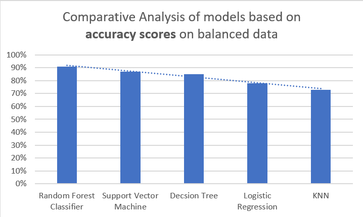

# Road Accident Severity Classification using ML

## Introduction

This study aims to propose an approach for road traffic severity classification using
machine learning techniques. The objective is to develop a fast and efficient system for
identifying the severity of road accidents and improving emergency response. We use a dataset of road accidents and their severity levels to train the model and classify the severity of future accidents.

## System Requirements

We use the following system requirements for this project:

- Python 3.x
- Ram >= 4 GB
- Storage >= 1 GB
- OS: Windows 11

## Tools and Technologies

We use the following tools and technologies for this project:

- Python 3
- Jupyter Notebook
- Pandas
- Numpy
- Matplotlib
- Seaborn
- Scikit-learn

## For Conda

Use the command to create a conda env with required packages \

👉 conda create -n {env-name} python=3.10 \
👉 conda activate {env-name} \
👉 conda install numpy matplotlib pandas scikit-learn seaborn jupyter imblearn

## Dataset

The dataset used for this project is the [Road Accidents Severity Dataset](https://www.kaggle.com/datasets/kanuriviveknag/road-accidents-severity-dataset) dataset from Kaggle. It contains 32 features and 12k records of road accidents.

## Data Preprocessing

We perform the following preprocessing steps on the dataset:

- Remove unnecessary features
- Remove records with missing values
- Convert categorical features to numerical features
- Normalize the dataset

## Exploratory Data Analysis

We perform the following exploratory data analysis on the dataset:

- Plot the distribution of the target variable
- Plot the distribution of the features
- Plot the correlation matrix of the features

## Model Training

We train the following machine learning models on the dataset by:

- K - Nearest Neighbours (KNN)
- Decision Tree Classifer
- Random Forest Classifier
- Support Vector Classifier (SVC)
- Logisitic Regression

## Model Evaluation

We evaluate the performance of the models using the following metrics:

- Accuracy
- F1 Score
- Confusion Matrix

## Results

Comparative Analysis (Imbalanced Data) \

Comparative Analysis (Balanced Data)

## Conclusion

In the context of road accident severity classification it has been observed that __number of vehicles involved__ and __number of casualties__ consistently emerge as significant factors indicating their strong influence on predicting the severity of accidents.

By incorporating the __number of vehicles involved__ and the __number of casualties__ into the predictive models machine learning algorithms can enhance road accident severity classification systems. This can play a important role in improving road safety measures, developing targeted interventions, and implementing proactive strategies to prevent accidents and minimize
their consequences.

## References

To be added.
